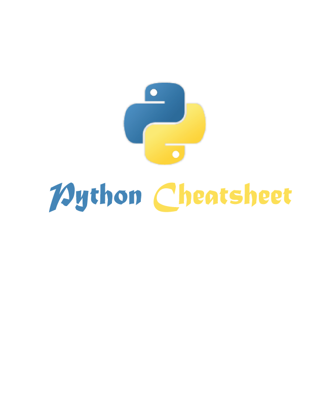

  
  

## Introduction
I have created this cheatsheet with intention of helping other developers by sharing my python code snippets that I have used on my projects to reduce time and make life easier. (written for humans)

 

## Contents

- ### [String](string.md)
- ### [Number](numbers.md)
- ### [File](files.md)
- ### [Functions](functions.md)
- ### [Classes](classes.md)
- ### [Date and Time](date-time.md)
- ### [Regular Expressions](regular-expressions.md)
- ### [Web Data Handling](web-data-handling.md)
- ### [Socket](socket.md)

   

## Contributing

Feel free to contribute and send pull requests. Not completed will update faster!

## Author

* [BisratYalew](https://bisratyalew.github.io)

## Licence

#### MIT
